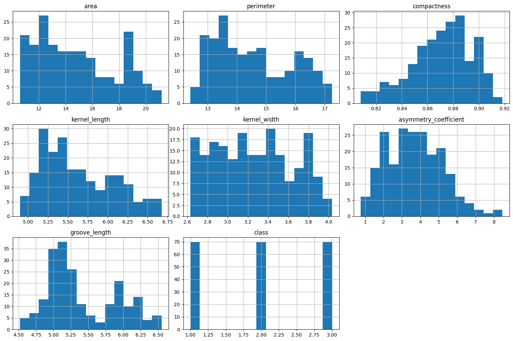
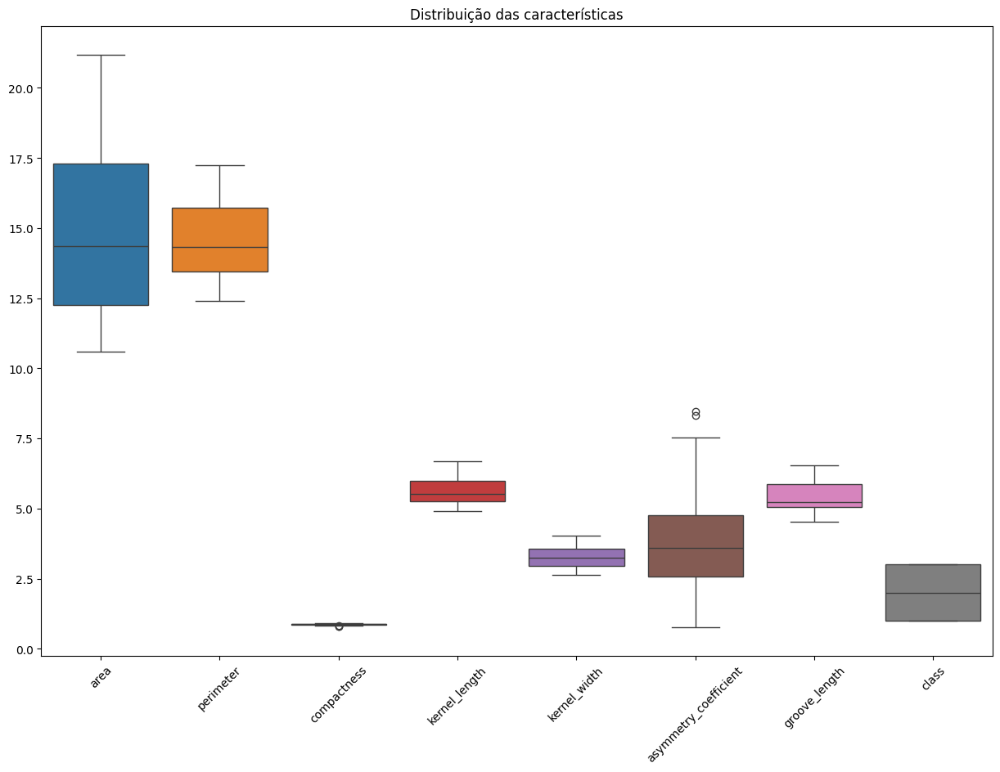
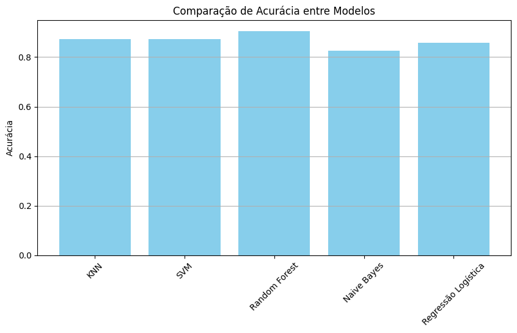
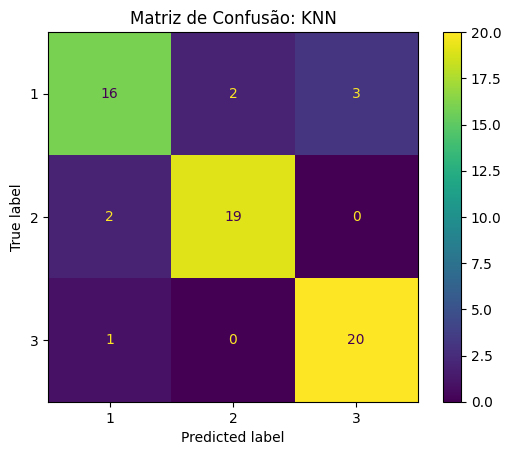
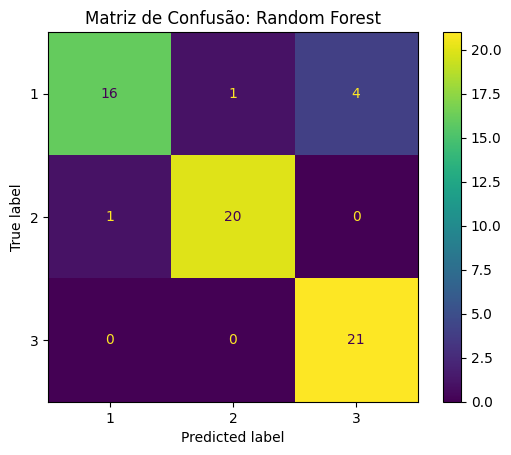
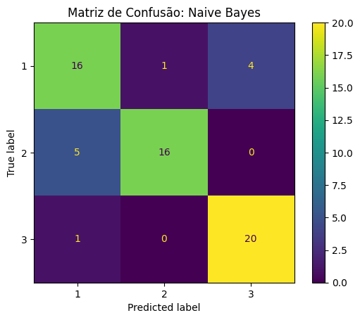

# FIAP - Faculdade de Informática e Administração Paulista

<p align="center">
<a href="https://www.fiap.com.br/"></a>
</p>

<br>

# Da Terra ao Código: Automatizando a Classificação de Grãos com Machine Learning

## Fase 4 – Capítulo 3  
Período: 21/05/2025 a 20/06/2025

## 👨‍🎓 Integrantes do Grupo 64:
- Deivisson Gonçalves Lima – RM565095 – [deivisson.engtele@gmail.com](mailto:deivisson.engtele@gmail.com)
- Omar Calil Abrão Mustafá Assem – RM561375 – [ocama12@gmail.com](mailto:ocama12@gmail.com)
- Paulo Henrique de Sousa – RM564262 – [pauloo.sousa16@outlook.com](mailto:pauloo.sousa16@outlook.com)
- Renan Danilo dos Santos Pereira – RM566175 – [renansantos4978@gmail.com](mailto:renansantos4978@gmail.com)

## 👩‍🏫 Professores:
### Tutor(a):
- Lucas Gomes Moreira  
### Coordenador(a):
- André Godoi Chiovato  

---

## 📜 Introdução

A classificação manual de grãos em cooperativas agrícolas é um processo demorado e suscetível a erros humanos. Com o avanço do aprendizado de máquina, é possível automatizar essa tarefa com maior precisão e velocidade. Este projeto tem como objetivo aplicar a metodologia **CRISP-DM** para desenvolver modelos de classificação utilizando **Scikit-learn**, avaliando a performance de diferentes algoritmos com base em características físicas de sementes de trigo.

---

## 🔧 Desenvolvimento

### 💡 Desafio

Desenvolver uma aplicação de machine learning com base no "Seeds Dataset" da UCI Machine Learning Repository, contendo atributos como área, perímetro, compacidade e outros dados físicos de grãos de três variedades distintas (Kama, Rosa e Canadian). O desafio envolveu:

- Análise exploratória e tratamento dos dados
- Comparação entre algoritmos de classificação
- Otimização dos modelos via GridSearch
- Interpretação de resultados e extração de insights

### 🧠 Soluções Aplicadas

- Utilização de bibliotecas como `pandas`, `seaborn`, `matplotlib` e `scikit-learn`
- Teste de 5 algoritmos:
  - KNN
  - SVM
  - Random Forest
  - Naive Bayes
  - Regressão Logística
- Avaliação por métricas: **acurácia**, **precisão**, **recall**, **F1-score** e **matriz de confusão**
- Otimização com `GridSearchCV` no modelo KNN
- Visualização com histogramas, boxplots, pairplots e gráficos comparativos

---

## 📈 Prints do Projeto

### 📊 Distribuições e Boxplots
- 
- 

### 📉 Acurácia dos Modelos
- 

### 🤖 Matrizes de Confusão dos Modelos
- 
- 
- 
- 
- 
- 

---

## 📂 Estrutura de Pastas

```
📁Fase4_Cap3/
├─ 📜classificacao_graos.ipynb
├─ 📜README.md
├─ 📜seeds_dataset.txt
├─ 📂imagens/
│   ├─ histograma.png
│   ├─ boxplots.png
│   ├─ acuracia_modelos.png
│   ├─ matriz_knn.png
│   ├─ matriz_knn_otimizado.png
│   ├─ matriz_svm.png
│   ├─ matriz_random_forest.png
│   ├─ matriz_naive_bayes.png
│   └─ matriz_regressao_logistica.png
```

---

## 📜 Licença

Este projeto foi desenvolvido exclusivamente para fins acadêmicos no contexto da disciplina de Inteligência Artificial da FIAP. Todos os direitos reservados aos autores mencionados.
